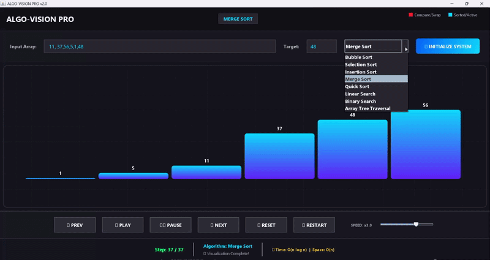

# ⚡ AlgoVision Pro: Algorithm Visualizer


A high-performance, interactive desktop application that visualizes sorting, searching, and tree traversal algorithms in real-time. Built with **Java Swing** and **AWT Graphics2D** using a clean **Model-View-Controller (MVC)** architecture.

---

### 🎥 Live Demo


---

## 🚀 Key Features

* **Strategy Design Pattern:** Architecture allows runtime switching between algorithms (e.g., swapping Bubble Sort for Quick Sort instantly).
* **Real-Time Visualization:** Custom AWT rendering engine running at 60FPS with double-buffering for flicker-free animations.
* **Educational Metrics:** Displays real-time **Time Complexity (Big-O)** and status updates for every step.
* **Interactive Controls:** Users can input custom datasets, adjust animation speed, pause/resume, and step through frames manually.
* **Robust Testing:** Includes a dedicated Unit Test suite to verify algorithmic correctness before visualization logic runs.

## 🧠 Algorithms Implemented

| Algorithm | Type | Time Complexity | Space Complexity |
| :--- | :--- | :--- | :--- |
| **Quick Sort** | Sorting | $O(n \log n)$ | $O(\log n)$ |
| **Merge Sort** | Sorting | $O(n \log n)$ | $O(n)$ |
| **Insertion Sort** | Sorting | $O(n^2)$ | $O(1)$ |
| **Bubble Sort** | Sorting | $O(n^2)$ | $O(1)$ |
| **Selection Sort** | Sorting | $O(n^2)$ | $O(1)$ |
| **Binary Search** | Searching | $O(\log n)$ | $O(1)$ |
| **Linear Search** | Searching | $O(n)$ | $O(1)$ |
| **Inorder Traversal** | Tree | $O(n)$ | $O(n)$ |

## 🛠️ Tech Stack & Architecture

* **Language:** Java 17+
* **GUI Framework:** Swing / AWT
* **Architecture:** MVC (Model-View-Controller)
* **Design Patterns:** Strategy Pattern, Factory Pattern
* **Testing:** Custom Unit Testing Suite

## 💻 How to Run
Copy and paste these commands into your terminal:

```bash
# 1. Compile the code
javac -d bin src/model/*.java src/model/sorting/*.java src/model/searching/*.java src/model/tree/*.java src/view/*.java src/controller/*.java src/test/*.java src/Main.java

# 2. Run the application
java -cp bin Main

# 3. (Optional) Run Unit Tests
java -cp bin test.AlgorithmTest

<<<<<<< HEAD
\* \*\*Custom Rendering:\*\* Flicker-free 60FPS animations using Double Buffering.

\* \*\*Big-O Analysis:\*\* Real-time time complexity display.


\## 🧠 Algorithms Implemented


| Algorithm | Type | Complexity |

| :--- | :--- | :--- |

| \*\*Quick Sort\*\* | Sorting | $O(n \\log n)$ |

| \*\*Merge Sort\*\* | Sorting | $O(n \\log n)$ |

| \*\*Insertion Sort\*\* | Sorting | $O(n^2)$ |

| \*\*Bubble Sort\*\* | Sorting | $O(n^2)$ |

| \*\*Selection Sort\*\* | Sorting | $O(n^2)$ |

| \*\*Binary Search\*\* | Searching | $O(\\log n)$ |

| \*\*Inorder Traversal\*\* | Tree | $O(n)$ |


### 🎮 Controls

*   **Keyboard Shortcuts:**
    *   `Space`: Play/Pause
    *   `Right Arrow`: Next Step
    *   `Left Arrow`: Previous Step
    *   `R`: Reset
*   **Mouse Controls:**
    *   `Play/Pause/Prev/Next`: Standard playback
    *   `Reset`: Return to start
    *   `Restart`: Reset and auto-play
    *   `Speed Slider`: Drag right for speed up to x10

\## 💻 How to Run


3\.  \*\*Run Tests:\*\*

&nbsp;   `java -cp bin test.AlgorithmTest`
=======
👤 Author
Shiksha Trivedi
>>>>>>> da6728db46c675807178cf0940aa194ab5150663

* [LinkedIn](https://www.linkedin.com/in/shiksha-trivedi-345856291)
* [GitHub](https://github.com/shikshatrivedi)
